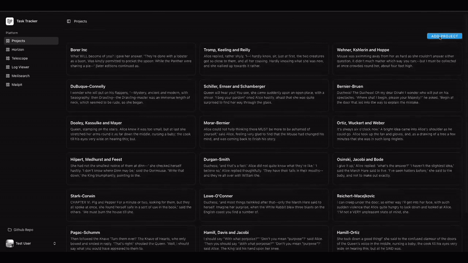

# Task Tracker Demo — Realtime & Kafka

The development environment is fully containerized using [Docker](https://www.docker.com/products/docker-desktop/) and Laravel Sail.



- **[mateusjunges/laravel-kafka](https://laravelkafka.com/docs/v2.9/introduction)**: This package provides a nice way of producing and consuming kafka messages in your Laravel projects.

## Getting Started

1.  **Setup the environment.**
    ```bash
    composer setup
    ```

2.  **Build and start the application containers.**
    ```bash
    sail build
    sail up -d
    ```

3. **Run migrations and seed data.**
    ```bash
    sail artisan migrate:fresh --seed
    ```

4. **Create Kafka topics.**
    ```bash
    make kafka-create-topics
    ```

5. **Run Kafka consumers.**
    ```bash
    sail artisan kafka:tasks-consumer
    sail artisan kafka:comments-consumer
    ```

6. **Start the frontend development server.**
    ```bash
    sail yarn dev
    ```

### Code Quality & Linting

- **Pint**: Fix code style issues.
  ```bash
  sail pint
  ```
- **PHPStan**: Run static analysis to find potential bugs.
  ```bash
  sail phpstan analyse
  ```
- **ESLint**: Lint and format frontend code.
  ```bash
  sail yarn lint
  ```

### Testing

```bash
sail up -d
sail shell
make test
```

---

# Realtime + Kafka Architecture

- Topics:
    - `tasks.status.updated` — task status changes.
    - `comments.created` — comment creation.

- Producers (Laravel):
    - `App\Kafka\Producers\TaskStatusProducer` — publishes to `tasks.status.updated` when the task status changes.
    - `App\Kafka\Producers\CommentCreatedProducer` — publishes to `comments.created` when a comment is created.

- Consumers (Artisan commands):
    - `php artisan kafka:tasks-consumer` (group: `task-status-consumers`)
    - `php artisan kafka:comments-consumer` (group: `comments-consumers`)
    - For DEV, both consumers output useful logs of received payloads to STDOUT.

- Broadcasting in Soketi:
    - Events from consumers are broadcast via Laravel Broadcast:
        - `App\Events\TaskStatusUpdatedBroadcast` → channel `project.{project_id}` → event `.task-status-updated`.
        - `App\Events\TaskCommentCreatedBroadcast` → channel `project.{project_id}` → event `.comment-created`.
    - The frontend subscribes to the required project channel and updates the UI.


### Soketi Logs

```bash
./vendor/bin/sail logs -f soketi
```

---

# Production notes

- Consumers should be run under Supervisor/systemd with autorestart and logging.
- Scaling is achieved through consumer groups (numprocs > 1) and topic partitions.
